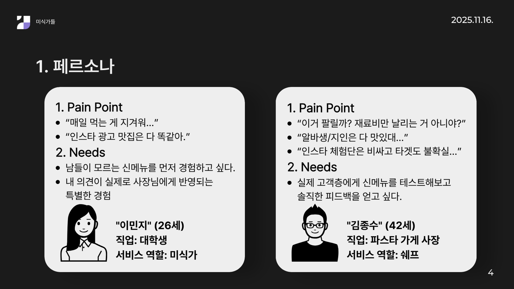
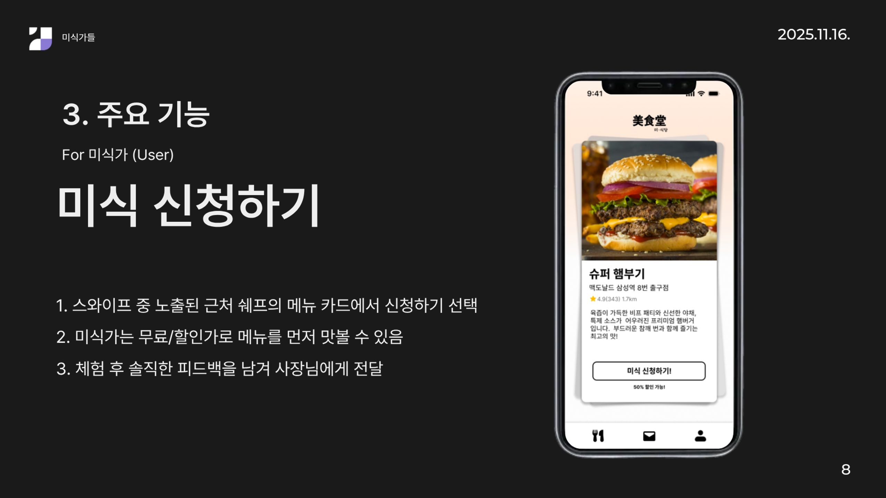
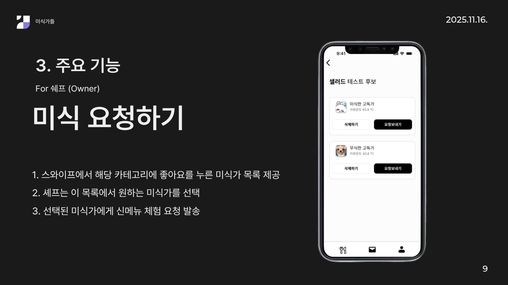

# 🍽️ 미식당 (美食堂)


> 당신에게 딱 맞는 음식 테스터 찾기 서비스 (2025 Uni-dthon 참가작)

## 📖 프로젝트 소개

미식당은 음식점 오너가 새로운 메뉴를 개발할 때 신뢰할 수 있는 소비자(미식가)들의 피드백을 받을 수 있도록 연결해주는 양방향 매칭 플랫폼입니다.

### 💡 문제 인식

<p>
    
    
</p>

- **사장님의 고민**: 신메뉴 개발 시 지인·알바 중심의 테스트에 의존하여 객관적인 피드백을 받기 어려움
- **소비자의 고민**: 새로운 음식을 시도하고 리뷰를 남기고 싶지만 적절한 기회를 찾기 어려움

### ✨ 주요 기능

<p>
    
    
    
</p>

#### 🔍 미식가(소비자) 모드

- 스와이프 방식으로 관심 있는 음식 카테고리와 메뉴 탐색
- 프로필 관리 및 리뷰 온도, 작성률 등 활동 지표 확인
- 오너의 테스트 요청 수락 및 리뷰 작성

#### 🏪 오너 모드

- 3단계 메뉴 등록 프로세스 (기본 정보 → 상세 정보 → 이미지 업로드)
- 등록된 메뉴 관리 및 카테고리별 분류
- 테스트 후보 미식가 조회 및 요청 이력 관리

#### 🎬 시연 영상

<video src="public/demo.mp4"  width="500" controls></video>

## 🛠 기술 스택

| 분류       | 기술                           |
| ---------- | ------------------------------ |
| Frontend   | React 19.2.0, TypeScript 5.6.2 |
| Build Tool | Vite 6.0.7                     |
| Styling    | Tailwind CSS 4.1.17            |
| Animation  | Framer Motion                  |
| Maps       | Google Maps API                |
| State      | localStorage (for prototyping) |

## Getting Started

### Prerequisites

- Node.js 18 or higher
- npm or yarn

### Installation

```bash
npm install
```

### Setup Environment Variables

Create `.env` file in the project root and set your Google Maps API key:

```env
VITE_GOOGLE_MAPS_API_KEY=your_google_maps_api_key_here
```

### Run Server

```bash
# Start development server (http://localhost:5173)
npm run dev

# Production build
npm run build
```
